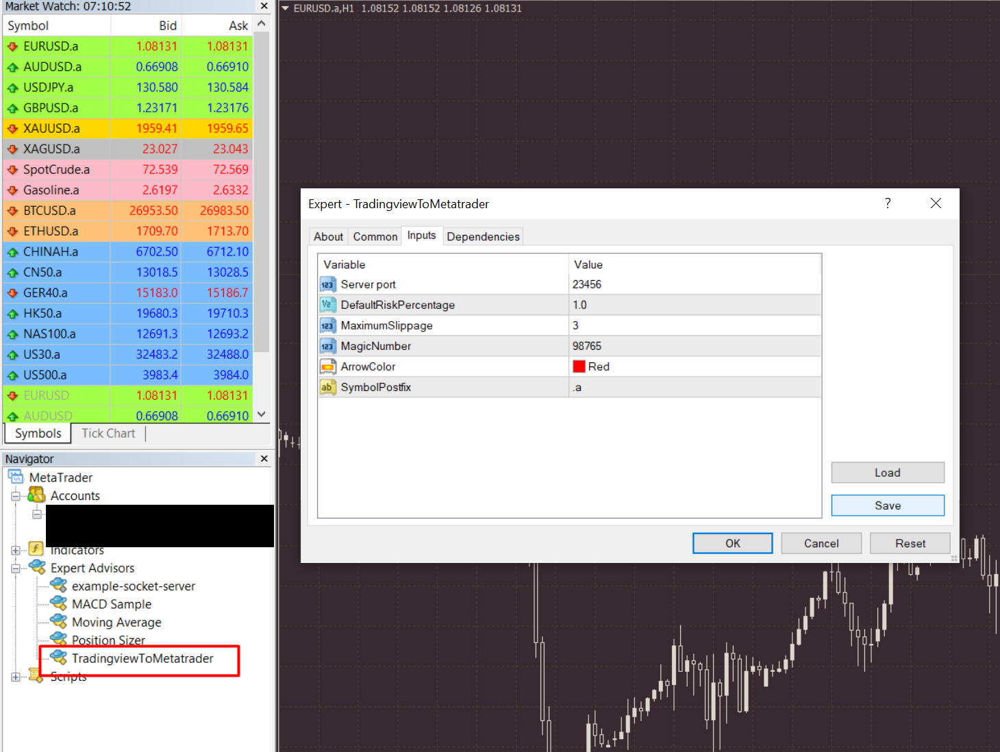
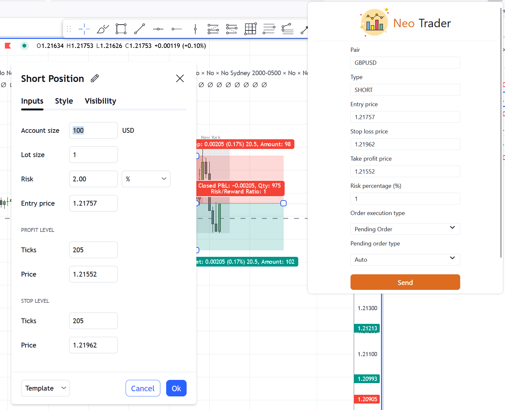

# TradingView To MetaTrader
### Send limit orders from Traingview to Metatrader platform with one click!

## How it works?
1. Install Expert Advisor in Metatrader terminal. (Currently only support for Metatrader 4)
    - Go to MT4 directory and copy the contents of Include and Experts directories into your Metatrader 
  data folder's Include and Experts directories respectively. 
    - Open Metatrader terminal and make sure you have enabled automated trading.
    - You will see `TradingviewToMetatrader` expert advisor in Metatrader experts section. Add 
  it to a chart and go to Inputs tab. Set following configurations according to your requirements.

      

      - ServerPort - port of the server to be run. Do not change this for now, because I have hardcoded
      this port in the browser plugin. I will add a settings page to browser plugin in the future to make this configurable.
      - DefaultRiskPercentage - Risk percentage per trade. This can be overridden using browser plugin.
      - MaximumSplippage - Maximum allowed splippage when executing the trade. This is not applicable to limit trades, 
      so we do not need to worry about this.
      - MagicNumber - A number to identify trades placed by this EA. No need to change.
      - ArrowColor - Forget it!
      - SymbolPostfix - Some brokers add some letters into the end of the symbol name. As you can see
      in above screenshot, symbol name is `EURUSD.a`. So `.a` should be added as SymbolPostfix.  
2. Install Browser extension. (Currently only support for Firefox)
   - Will be published soon.. :)
3. Send positions from Tradingview to Metatrader.

    

   - Open a chart in trading view and draw a position using position tool and double-click on it.
   Position details popup will appear. 
   - Open the extension, and it will show the position details. Then click on `Send` button. Trade 
   will be placed in the Metatrader platform.

## Credits:
I have used following references to build this project.
- https://www.mql5.com/en/blogs/post/706665
